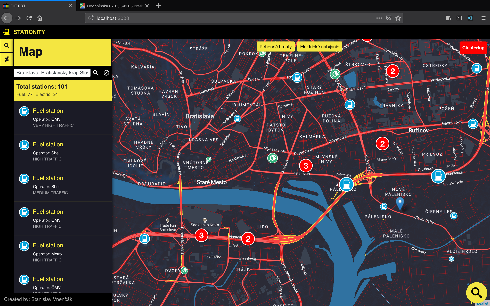
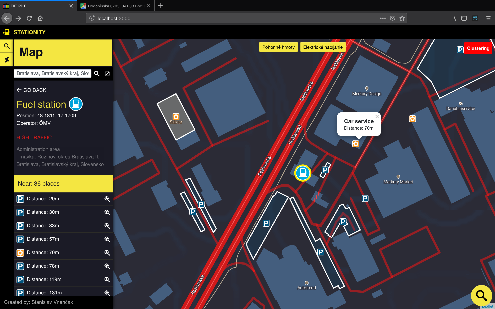
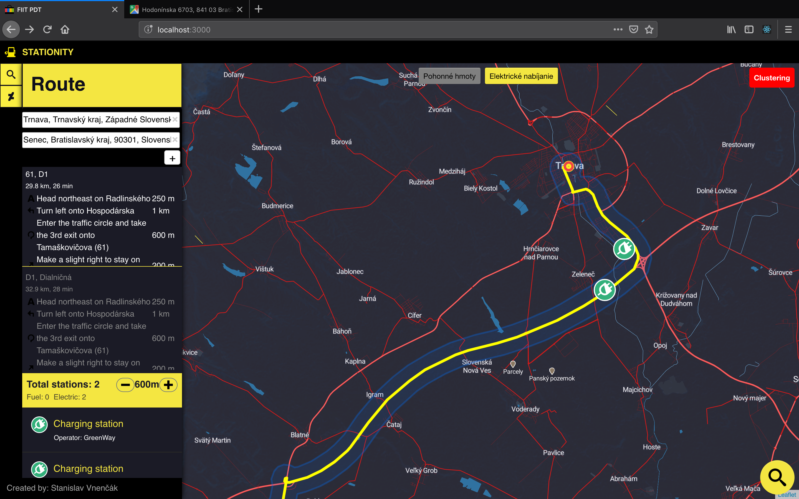

# Overview
#### Author: Stanislav Vnenčák

This application is designed to simplify searching for fuel and electric stations in Slovak Republic. 
Most important features are:
- search stations by searching the map in visible bounds (more important stations are bugger - closer to highways) 
- search stations by address (reverse geolocated from name or from current position)
- search stations near route (according to distance from route - adjustable)
- filter displayed stations (fuel, electric)
- display stations detail 
    - station type 
    - GPS position
    - nearest special points with distance to them - parking lots and car services
    - administration area
    - importance (according to highway distance)

This is starting page of the application (with selected both fuel and electric stations in Bratislava):



If you select one of stations, you can see station detail:



You can also search for stations according to selected route:



The application is made of 2 separate parts, 
the client side which is a [frontend web application](#frontend) implemented in [React](#React) and a server side is written in JavaScript and [NodeJS](#NodeJS).


- React, Redux, Bootstrap - FE part of application
- Node.js, Express - BE part of application
- Leaflet (react-leaflet) - maps API
- Leaflet Routing Machine (leaflet-routing-machine) - routing (route calculation and display)
- Squel - query builder
- Nominatim OpenStreetMap - reverse geocoding (search address)

# Frontend

The client side of application is a [frontend web application](#frontend) implemented in [React](#React), [Redux](#Redux) using [Bootstrap](#Bootstrap) 
library, maps are implemented using using [Leaflet](#Leaflet) (react-leaflet) library.

On FE part of application users can search for stations by searching the map in visible bounds (more important stations are bugger - closer to highways),
search stations by address (reverse geolocated from name or from current position),
search stations near route (according to distance from route - adjustable)
filter displayed stations (fuel, electric) and 
display stations detail, such as station type, GPS position, nearest special points with distance to them - parking lots and car services, administration area or importance (according to highway distance).

All relevant frontend code is in `app/src` folder. The frontend code is pretty complicated as it is responsible for:
- detecting user's location, using the standard [geolocation API](https://developer.mozilla.org/en-US/docs/Web/API/Geolocation/Using_geolocation) for searching near stations
- reverse geolocation address by name for searching stations at address
- displaying the sidebar panel with stations list and map with filtering controls, driving the user interaction and calling the appropriate backend APIs
- displaying geo features using react-leflet libryry components
- getting and displaying route using leaflet-routing-machine for searching stations near this route

## Customized map layer

In our application we use Leaflet SDK for displaying map with a special layer created in [MapBox Studio](https://www.mapbox.com/studio/).
Main features of custom layer:
- dark mode (labels, buildings, terrain)
- highligted roads
- higligted Slovakia borders (app uses Slovakia osm data)

Used layer is available [HERE](https://api.mapbox.com/styles/v1/speedo-sp7/cjozxl4oa07872smnue9hta5c.html?fresh=true&title=true&access_token=pk.eyJ1Ijoic3BlZWRvLXNwNyIsImEiOiJjamZ0bjZxaGYzc3ZzMzBwb3h0djlhM244In0.JJDM4N-31AlH1eF7vJDpCQ#11.2/48.985392/18.161769/0).

# Backend

The [backend application](#backend) is written in JS, [NodeJS](#NodeJS) and [Express](#Express), backed by PostGIS. The client side of application
communicates with backend using a [REST API](#api). Server communicates with DB using [Squel Query Builder](#Squel) (Squel.js) for dynamic queries. 
Server is responsible for querying geo data, formatting the geojson and sending data back to client side for rendering.

Used PostGis functions:
 - ST_WITHIN
 - ST_INTERSECTS
 - ST_DISTANCE
 - ST_BUFFER
 - ST_CONTAINS
 - ST_MAKEENVELOPE
 

## Data

Stations data is coming directly from Open Street Maps covering whole Slovakia (around 3.83GB, slovakia-latest.osm) and imported using the `osm2pgsql` tool into the standard OSM schema using by running `osm2pgsql -m -U stanislav -d fiit_pdt_project -H localhost slovakia-latest.osm`. 

### Indexes 

To speedup the queries I created some indexes over geo data. 
- osm_id: index over osm_id in table planet_osm_point for faster stations querying
- amenity: index over amenity in table planet_osm_point and planet_osm_polygon for faster filtering of fuel and electric stations
- shop: index over shop in table planet_osm_point and planet_osm_polygon for faster filtering of car services
- highway: index over shop in table planet_osm_line for faster filtering of highways
- way: index over way in table planet_osm_point, planet_osm_line and planet_osm_polygon (geo feature)

GeoJSON is generated by using a standard `ST_AsGeoJson` function.

All the queries for indexing can be found in enclosed file [indexes.sql](indexes.sql).

## Api

**1. Get all stations within visible bounds (polygon) and according to requested station types**

`POST /getAllStationsWithinPolygon`

Request body:
```
{ 
    bounds:{ 
        _southWest: { 
            lat: 48.592050872804194, 
            lng: 16.969327926635746 
        },
        _northEast: {
            lat: 48.636652222048916, 
            lng: 17.064771652221683 
        } 
    },
    types: [ 
        'fuel', 
        'charging_station'
    ]
}
```
Response: API return stations (Array of Points) within polygon from API parameter with with basic parameters (osm_id, amenity, operator, center) and parameter importance.
Parameter importance is calculated from distance to nearest highway.

Importance types are in app used as following:
- 3.50: "VERY HIGH TRAFFIC"
- 2.50: "HIGH TRAFFIC"     
- 1.75: "MEDIUM TRAFFIC"
- 1.25: "NORMAL TRAFFIC"       
- 1.00: "LOW TRAFFIC"
            
```
[
    {
        osm_id: '2810429301',
        amenity: 'fuel',
        operator: 'Slovnaft',
        center_json: {
            type: 'Point',
            coordinates: [
                17.2442424243206,
                48.1941204745271
            ]
        }
        importance: '2.5' 
    }, ... more items
]
```

**2. Get all stations near route (within distance - in meters) according to requested station types**

`POST /getStationsNearRoute`

Request body:
```
{ 
    coordinates: [
        {
            lat: 48.592050872804194,
            lng: 16.969327926635746
        },
        {
            lat: 48.636652222048916, 
            lng: 17.064771652221683
        },
        ... more items 
    ],
    distance: 100,
    types: [ 
        'fuel', 
        'charging_station'
    ]
}
```
Response: API returns resulting stations in result (Array of Points) and corresponding buffer (Polygon) created from route and distance parameter
```
{ 
    result: [  
        {
            osm_id: '3606105518',
            amenity: 'fuel',
            operator: null,
            center_json: {
                type: 'Point',
                coordinates: [
                    17.2442424243206,
                    48.1941204745271
                ]
            }
        }, ... more items
    ],
    buffer: { 
        type: 'Polygon'
        coordinates: [
            [
                [
                    17.2442424243206,
                    48.1941204745271
                ]  ... more items
            ], ... more items
        ]
    } 
}

```

**3. Get all station data**

`POST /getStation`

Request body:
```
{ 
    osmId: '2017055184' 
}
```
Response: API returns station with basic parameters (osm_id, amenity, operator, center)
```
{
    osm_id: '5497403147',
    amenity: 'charging_station',
    operator: 'Slovnaft',
    center_json: {
        type: 'Point',
        coordinates: [
            17.2442424243206,
            48.1941204745271
        ]
    }
} 
```

**4. Get all station areals (polygon data if station is within any polygon with station amenity)**

`POST /getStationAreals`

Request body:
```
{ 
    osmId: '2017055184' 
}
```
Response: API returns array of station areals (Array of Polygons)
```
[
    {
        osm_id: '-8438054',
        admin_level: 4,
        boundary: 'administrative',
        name: 'Trnavský kraj',,
        amenity: null,
        shop: null,
        way_json: {
            type: 'Polygon'
            coordinates: [
                [
                    [
                        17.2442424243206,
                        48.1941204745271
                    ]  ... more items
                ], ... more items
            ]       
        },
        center_json: {
            type: 'Point',
            coordinates: [
                17.2442424243206,
                48.1941204745271
            ]
        }
    }, ... more items
]

```


**5. Get all special places near selected station (parking places and car services, within distance - in meters)**

`POST /getAllSpecialPlacesNearStation`

Request body:
```
{ 
    coordinates: [ 
        17.0138963, 48.6136392997881 
    ], 
    distance: 500 
}
```
Response: API returns parking points (Array of Points) and parking areas (Array of Polygons) which are of type car repair or parking. These two sets are disjoin (preprocessed on server).
```
{ 
    points: [
        {
            osm_id: '367873922',
            shop: 'car_repair',
            amenity: null,
            way: 'SGHJ010ZTEVHDF6753G784GDD4916B5741B574...',
            center_json: {
                type: 'Point',
                coordinates: [
                    17.2452786573737,
                    48.1843486445271
                ]
            },
            distance: 28.75
        }, ... more items
    ], 
    areas: [
        {
            osm_id: '367873922',
            shop: null,
            amenity: 'parking',
            way: '01030000201CD4916B5741B5741E1C5DC47234B3D...',
            center_json: {
                type: 'Point',
                coordinates: [
                    17.2442424243206,
                    48.1941204745271
                ]
            },
            way_json: {
                type: 'Polygon'
                coordinates: [
                    [
                        [
                            17.2442424243206,
                            48.1941204745271
                        ]  ... more items
                    ], ... more items
                ]
                
            },
            distance: 102.43
        }, ... more items
    ] 
}

```

All the queries can be found in enclosed file [queries.sql](queries.sql).